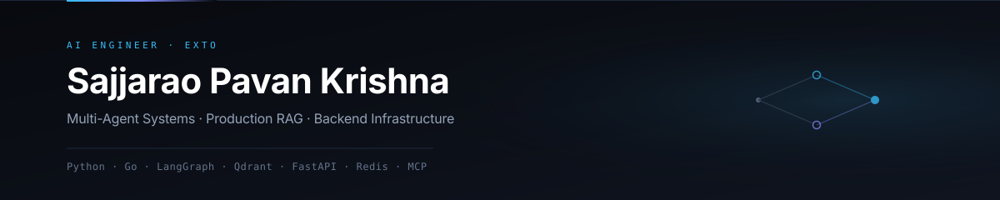

  

  
  &nbsp;
  
  &nbsp;
  

### About

AI Engineer (SDE 1) at **Exto**, building multi-agent systems and production RAG.

*Day-to-day work lives in private enterprise repos. This space showcases open-source architectures, experiments, and field notes.*

---

### Focus

- **Multi-Agent Systems** — Orchestrating specialized agent workflows, memory, and tool use with LangGraph and MCP.
- **Production RAG** — Hybrid retrieval (Dense + Sparse + RRF), cross-encoder reranking, and hierarchical chunk expansion.
- **Backend & Streaming** — Low-latency APIs, SSE streaming, and agent infrastructure in Python and Go.
- **Evals & Guardrails** — Tracing, latency benchmarks, and hallucination evaluation with Opik.

---

### Stack

`Python` `Go` `LangGraph` `Qdrant` `FastAPI` `Redis` `PostgreSQL` `Docker`

---

### Projects & Writing

- **[CITE-RAG](https://github.com/Pavan048/CITE-RAG)** — Enterprise RAG engine with autonomous multi-hop reasoning, hierarchical chunk expansion, and enforced citations.
- **Multi-Agent Assistant** — Task routing across specialized sub-agents with two-tier memory (Redis + Qdrant) and MCP tool interfaces.
- **[My-Field-Notes](https://github.com/Pavan048/My-Field-Notes)** — Personal engineering archive covering open-source teardowns, system design (HLD/LLD), and DevOps.
